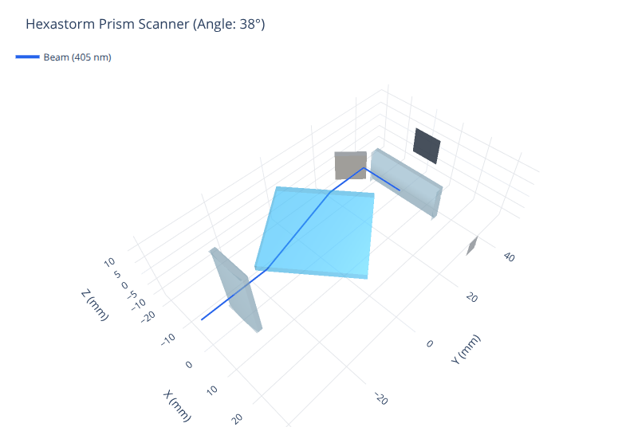

# Optical Design & Simulation (Prisms)

Optical design, analytical modeling, and 3D ray-tracing simulations for the laser prism scanner known as **Hexastorm**.

This package provides the optical calculations used by:
* **Hexastorm Design**: [github.com/hstarmans/hexastorm_design](https://github.com/hstarmans/hexastorm_design)
* **Hackaday Project**: [hackaday.io/project/21933-open-hardware-transparent-polygon-scanner](https://hackaday.io/project/21933-open-hardware-transparent-polygon-scanner)
* **RepRap Project**: [reprap.org/wiki/Open_hardware_fast_high_resolution_LASER](https://reprap.org/wiki/Open_hardware_fast_high_resolution_LASER)
* **Video Walkthrough**: [YouTube Explanation](https://youtu.be/kekMkjqzRjE)

---

## Optical Layout & Ray Tracing



### Layout Overview (Shown at 38° Start-of-Scan Angle)

* **Clockwise Prism Rotation & Start-of-Scan (SOS)**: The transparent N-BK7 polygon prism rotates clockwise, sweeping the refracted beam across the scan field from left to right. Synchronization must occur at the **beginning of each scanline**, which is why the pick-off mirror is positioned on the left (`X = -11 mm`).
* **Mounting Wall Clearance**: The pick-off mirror is positioned at `Y = 25 mm`, ensuring the reflected beam travels at `Y = 27.92 mm`—passing cleanly in front of Cylindrical Lens 2 (`Y ≥ 29.5 mm`) and the laserhead mounting wall to reach the photodiode sensor on the far right (`X = 35 mm`).
* **Spot Circularization & Anamorphic Correction**: Two crossed cylindrical lenses (`CL1` at `Y = -29 mm` and `CL2` at `Y = 31 mm`) circularize the elliptical laser diode output and suppress cross-scan error caused by facet-to-datum manufacturing tolerances.
* **Telecentric Projection**: Over the active exposure range (`X ∈ [-5.2, +5.2] mm`), the beam exits at a perpendicular 90° angle, maintaining uniform spot geometry and enabling seamless multi-lane stitching.

---

## Key Optical Advantages

1. **Telecentric Exposure**: Unlike reflective galvanometer or polygonal mirror scanners where the incident angle varies dynamically across the scanline, refraction through rotating parallel faces produces a naturally telecentric scan (always 90° to the substrate). This eliminates parallax distortion when stitching adjacent lanes.
2. **4× Less Sensitive to Facet Errors**: For a refractive prism with refractive index n ≈ 1.5, a 1° facet-to-datum manufacturing imperfection causes only ~0.5° of beam deflection (`(n - 1) × α`). In contrast, a reflective mirror doubles angular error to 2.0° (`2 × α`).
3. **Scalable Multi-Head Stacking (90° Tilt Optimization)**: Multi-beam single-polygon scanners must tilt the polygon axis (e.g., α ≤ 45° relative to substrate motion) to prevent simultaneous beam lines from overlapping, which reduces the effective scan angle and usable scan length (`y_length = sin(α) × S_L`). Hexastorm eliminates this limitation by keeping each modular head at the optimal **90° static polygonal tilt angle** (100% scan length utilization, `sin(90°) = 1.0`). Wide substrate coverage is achieved by modularly tiling independent single-beam heads across width and depth (staggered array), providing seamless lane stitching without line-overlap constraints.
4. **Open Hardware Prior Art**: An unpatented optical architecture based on foundational prior art by Lindberg ([US Patent 3,253,498](https://patents.google.com/patent/US3253498), 1966), establishing robust open-source freedom of use.

---

## Features

1. **Analytical Model (`prisms.analytical`)**
   * Implements James C. Wyant's optical testing and aberration theory for plane-parallel rotating plates.
   * Computes diffraction-limited Gaussian beam waist spot size and Rayleigh range.
   * Calculates longitudinal and transversal focus shift through rotating polygon facets.
   * Computes 3rd-order Seidel aberrations (spherical, coma, astigmatism), λ OPD RMS, and Strehl ratio.
   * Analyzes scanline duty cycle, non-uniform sweep velocity, and cross-scan facet-to-datum errors.

2. **Ray-Tracing Simulation (`prisms.system` & `prisms.library`)**
   * Non-sequential 3D ray tracing using upstream [pyOpTools](https://github.com/cihologramas/pyoptools).
   * Models N-BK7 polygon prisms, Edmund Optics cylindrical lenses, fold mirrors, and photodiode detection targets.
   * Automatically determines synchronization photodiode hit angles (`find_object('diode')`) and focal plane positioning.

3. **Live CAD Optics Verification (`prisms.cad_verifier`)**
   * Connects to a running FreeCAD session live via XML-RPC (port 9875 / FreeCAD MCP).
   * Automatically extracts global transforms of optical components (`lenstube`, `CLens1`, `prism`, `CLens2`, `mirror`, `photodiode`).
   * Validates mechanical alignment against optical tolerances (laser axis alignment, cylinder lens centering, confocal focal plane distance).
   * Pushes exact 3D ray compounds (405 nm violet laser) back into the active FreeCAD document (`Simulation/Rays`).
   * Run with:
     ```bash
     uv run python -m prisms.cad_verifier
     ```

4. **Modern Interactive Notebooks (`Notebooks/`)**
   * **Marimo Reactive Apps**: Launch interactive simulations with live sliders via `uv run marimo edit Notebooks/plot_system.py` or `uv run marimo edit Notebooks/system_compact.py`.
   * **Universal Plotly 3D Views**: Hardware-accelerated WebGL visualization of rays and optical components.

---

## Installation & Setup

This repository uses [`uv`](https://docs.astral.sh/uv/) for fast, reproducible, and modern dependency management.

Clone the repository and synchronize the environment:

```bash
# Sync core dependencies and dev/notebook groups
uv sync --all-groups
```

To install this package in editable mode in an external project (such as `hexastorm_design`):
```bash
uv add --editable /path/to/opticaldesign
```

---

## Running Tests

Run the complete automated test suite with `pytest`:

```bash
uv run pytest -v
```

Lint and format code using `ruff`:

```bash
uv run ruff check .
uv run ruff format .
```

---

## Interactive Notebooks

Launch either reactive Marimo application with live sliders:

```bash
# Full scanner simulation (with cylindrical lenses)
uv run marimo edit Notebooks/plot_system.py

# Compact layout & Fresnel reflection analysis
uv run marimo edit Notebooks/system_compact.py
```

Or run directly in headless/script mode:

```bash
uv run python Notebooks/plot_system.py
uv run python Notebooks/system_compact.py
```

---

## Mathematical Summary (Wyant Aberration Theory)

The analytical model in `prisms.analytical` implements the wavefront aberration theory published by **James C. Wyant** in [*Basic Wavefront Aberration Theory for Optical Metrology*](http://rohr.aiax.de/BasicAberrationsandOpticalTesting.pdf).

### 1. 3rd-Order Seidel Aberrations for Tilted Plane-Parallel Plate
A rotating polygon facet of thickness T and refractive index n tilted at angle of incidence θ introduces 3rd-order wavefront aberrations:
* **Spherical Aberration** (Wyant p. 42, eq. 72):
  `sabr = -T / f_numb⁴ × ((n² - 1) / (128 × n³))`
* **Coma** (Wyant p. 44, eq. 75):
  `coma = -T × θ / f_numb³ × ((n² - 1) / (16 × n³)) × cos(φ)`
* **Astigmatism** (Wyant p. 45, eq. 77):
  `astig = -T × θ² / f_numb² × ((n² - 1) / (8 × n³)) × cos²(φ)`

### 2. Optical Path Difference (OPD) & Strehl Ratio
* **Wavefront Error Variance** (Wyant p. 37, eq. 62):
  Evaluated across the normalized circular pupil (ρ ∈ [0, 1], φ ∈ [0, 2π]) via double quadrature:
  `σ² = (1/π) × ∫∫ [ΔW(ρ, φ)]² ρ dρ dφ - [(1/π) × ∫∫ ΔW(ρ, φ) ρ dρ dφ]²`
* **λ OPD RMS**:
  `λ_RMS = σ / λ`
* **Strehl Ratio** (Wyant p. 39, eq. 67):
  `Strehl ≈ 1 - (2π × λ_RMS)² + (2π × λ_RMS)⁴ / 2`

### 3. Literature Benchmark
The numerical integration in `p.lambda_opd_rms(θ)` reproduces the published Wyant literature values (tested in `tests/test_analytical.py` for T = 35 mm, f = 90 mm, D = 1.2 mm, n = 1.53, λ = 405 nm):

| Tilt Angle (θ) | Wyant Literature (`λ OPD RMS`) | `prisms.analytical` (`λ OPD RMS`) |
| :---: | :---: | :---: |
| **10°** | `0.005` | `0.0055` |
| **24°** | `0.032` | `0.0315` |
| **30°** | `0.050` | `0.0493` |

### 4. Scanner Geometry & Focus Shifts
* **Gaussian Waist Radius**: `waist = (2 × λ / π) × f_numb`
* **Rayleigh Length**: `z_r = π × waist² / λ`
* **Longitudinal Focus Shift**: `slong = ((n - 1) / n) × T` (Wyant p. 41, eq. 68)
* **Transversal Focus Shift**: `disp = T × sin(θ) × (1 - cos(θ) / sqrt(n² - sin²(θ)))` (Wyant p. 41, eq. 70)
* **Duty Cycle**: `duty_cycle = max_recommended_angle / max_angle_incidence`
* **Cross-Scan Error**: `cross_err = max(tan((n - 1) × apex_angle) × focal_distance, transversal_shift(apex_angle))`

---

## Architecture

```
opticaldesign/
├── src/prisms/
│   ├── __init__.py       # Top-level exports (PrismProperties, PrismScanner, Polygon)
│   ├── analytical.py     # Wyant physics formulas, aberrations, and Strehl calculations
│   ├── library.py        # Custom pyOpTools components (regular Polygon prism)
│   ├── system.py         # Complete optical system layout and ray-tracing routines
│   └── viewer.py         # 3D Plotly visualization integration
├── Notebooks/
│   ├── plot_system.py    # Interactive Marimo scanner simulation (cylinder layout)
│   └── system_compact.py # Interactive Marimo compact layout & reflection analysis
├── docs/
│   └── images/
│       └── prism_scanner_38deg.png # 3D ray-tracing layout diagram
├── tests/
│   ├── test_analytical.py # Analytical formulas & Wyant literature benchmark tests
│   ├── test_library.py    # Polygon geometry tests
│   ├── test_system.py     # Ray propagation & diode hit detection tests
│   └── test_viewer.py     # 3D Plotly visualization tests
├── pyproject.toml         # Standard PEP 621 configuration managed by uv
└── uv.lock                # Fully pinned, reproducible lockfile
```

---

## License

GPL-3.0-or-later.
